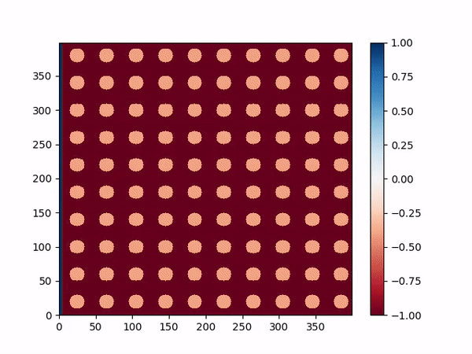
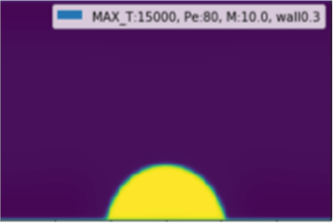
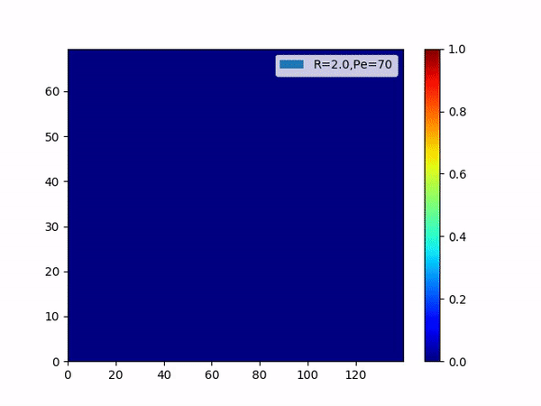

# Fingering_dynamics
two phase lattice boltzmann with zou-he boundary and half way bounce-back
[citation](https://www.sciencedirect.com/science/article/pii/S0377025715002037?via%3Dihub)

    ├── lattice_boltzmann            # Lattice boltzmann code
    │   ├── bounce_back.py           # half way bounce_back for block
    │   ├── create_block.py          # create block
    │   ├── fingering.py             # Poiseuille flow in porous medium
    │   ├── fingering_periodic.py    # Poiseuille flow in porous medium with periodic boundary
    │   ├── fingering_per_gpu.py     # gpu version of fingering_periodic.py 
    │   └── valitation.py            # wettability validation
    |── spectrum_method              # viscous fingering simulation by spectrum_method
    │   ├── main.py                  # Non reactive viscous fingering (https://aip.scitation.org/doi/10.1063/1.866726)
    │   ├── main_3phase.py           # three phase precipitation viscous fingering (https://journals.aps.org/pre/abstract/10.1103/PhysRevE.93.023103)
    │   
    
./lattice_boltzmann/fingering.py

./lattice_boltzmann/validation.py

./spectrum_method/main_3phase.py

